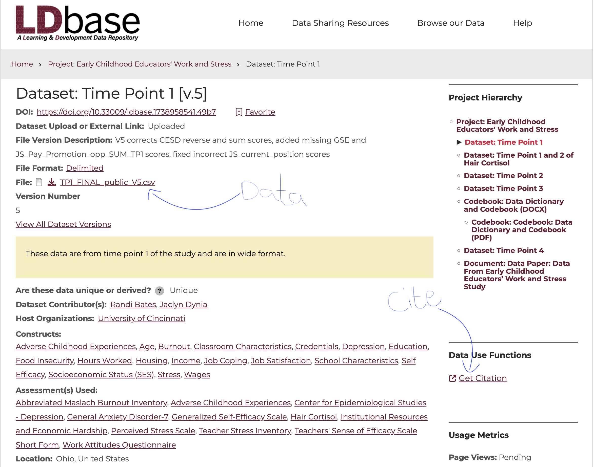

# Project Overview

The goal of this project is for you to demonstrate your ability to apply the statistical concepts and techniques we have covered in this course to a meaningful psychological research problem. You will work with a real-world psychology dataset and use statistical reasoning to explore relationships, differences, patterns, or other phenomena that are relevant to psychology. You are **not** expected to conduct an exhaustive analysis by generating every statistic or visualization we have learned in the course. Instead, I expect you to demonstrate your ability to ask meaningful research questions and answer them using carefully selected descriptive statistical analysis techniques and tools. All analyses must be conducted in **SPSS**.

Your group will select a psychology dataset from the [**Journal of Open Psychology Data**](https://openpsychologydata.metajnl.com/){target="_blank"}, which publishes openly accessible datasets associated with psychological research. After selecting a dataset, your group will investigate and become familiar with the study from which the data originated. You should consider questions such as: Who participated in the study? How was the sample obtained? What population might the researchers have been interested in? What variables were collected, and what types of variables are they? What psychological concepts or constructs are being measured? Your team will then identify a research topic or goal and develop **two research questions** directly related to that topic. You will answer these questions by conducting appropriate statistical analyses of the dataset in SPSS. Your analyses should include both **numerical summary statistics** (such as means, medians, etc) and **data visualizations** (scatter plots, box plots, bar graphs, etc), and the statistics and visualizations you choose should complement one another and be appropriately connected to help tell a coherent story about your topic and questions.

# Research Topic and Questions

Your research topic and Questions should be descriptive in nature (not inferential). This means your primary goal is to explore the data and understand any trends/patterns without attempting to run inferential statistics (e.g., hypothesis testing). You may be able to draw some insights about the population but you should be cautious not to frame your findings as though you performed inferential statistics (this is for the second project).

Your research topic is a short statement that describes the general area of interest that your research questions will be addressing. It should be broad enough to allow for multiple research questions to be asked, but specific enough to give a clear idea of what you are interested in. For example, if you are interested in the relationship between income and happiness in the US, your research topic could be "**The relationship between income and happiness in the United States**." This topic could then be used to generate multiple research questions, such as

- ***Question 1:*** What is the nature of a relationship between income and happiness in the US?

- ***Question 2:*** How does the relationship between income and happiness vary by age?

- ***Question 3:*** How does the relationship between income and happiness vary by sex?

Your research topic and questions often determine the kinds of data that you need and the data collection tools to be used. Since you will be using existing data for this project, you will need to examine your chosen data set closely and decide the best questions that can be answered using the available data.

# The Data

The important thing to know is that **the [Journal of Open Psychology Data](https://openpsychologydata.metajnl.com/){target="_blank"}** is primarily a catalog of data papers, not a single downloadable-data repository. Each article describes a particular psychology dataset and tells you where the actual files are hosted. The journal specifically publishes papers describing datasets with high reuse potential.

Follow these steps to find a dataset:

- Find a data paper you are interested in: Browse the journal's volumes/issues or search for a topic such as *memory*, *personality*, *Stroop*, *depression*, *social psychology*, etc.

- Open the article/PDF.

- Look for a section called something like Repository location, Data Availability, Dataset location etc. This is where the authors identify the actual repository containing the files.

- Follow the repository link. Common destinations are **OSF, GitHub, Dataverse**, or an **institutional repository**.

- Download the actual data file (Down the csv or SPSS files).

::: callout-important
- Please download the data documentation or code book as well so you can understand the variables and how they were measured.

- You will need to cite the data source in your report, so note down the citation guide given on the page.
:::

Here is an example of a data landing page:

{width="663"}

## Other Data Sources

The following data sources are not specific to psychology but you may explore them to see if there is any data that fits your needs.

- [Kaggle](https://www.kaggle.com/datasets): This is a platform for predictive modeling and analytics competitions in which companies and researchers post data and statisticians and data miners from all over the world compete to produce the best models.

- [Openintro](https://www.openintro.org/data/) website: Most of these data sets can be loaded into your work space as long as the openintro package is installed and running. I recommend you use this option if you are new to R and RStudio.

- [FiveThirtyEight](https://data.fivethirtyeight.com/): This is an American website that does opinion poll analysis on politics, economics, and sports in the United States. 538 shares their data sets, related articles, and code.

# Project Report

Your project report should be written in a clear and concise manner, and should include the following sections:

## Abstract

The abstract should be a brief summary of your research topic, questions, data, methods, and main findings. It should be no more than 350 words. It is best to write the abstract after you are done with all the other parts of the project.

Click on the following link to read an example of a well written abstract:

[Sample Abstract](https://cornerstone.lib.mnsu.edu/urs/2022/poster-session-01/4/)

## Introduction

The introduction section introduces your topic and provides the background. In this section, you will need to provide a rationale for your chosen topic and/or questions and describe why we should care. Consider citing a few articles in the introduction section to help you make your case.

## Research Questions

Write down two to three research questions that you will answer as part of your study. Both questions should address your research topic. In other words, you should not have questions that are unrelated as this might suggest you are doing two different studies in one. The variables of interest should be clearly identified in each question.

## Literature Review

Find 5 to 7 articles about your topic, read and synthesize them to show what previous researchers have done on that topic. If the articles were empirical studies, you need to state the rationale for the study, the methods used (e.g. experimental, observational, mixed methods), findings, etc. The goal is to situate your own study in the context of existing studies/literature.

## Methods

The methods section should describe the data and the methods used to analyze the data. This section should include the following subsections:

### Sample and Sampling Method

Describe your sample and its characteristics. Who are the participants and how many are they? What are their demographics? What data were collected and how were these data collected? e.g., surveys etc). What is the target population ? What sampling method was used and how does this impact whether or not the sample is representative of the population?   ***Note that*** since you are using existing data that you did not collect, I will allow you to speculate on some of the data collection techniques as long as the speculation seems reasonable. You will do this only when you cannot find enough information in the documentation for the data set of your choice.

### Data Analysis Techniques

Describe the data analysis techniques that you used to answer each of your research questions. This section should include a description of the **variables** used in the analysis, their types (continuous vs discrete), and how their measurement levels (nominal, ordinal, etc.). You should also describe any data transformations (pre-processing) that was done before the analysis. Finally, you should describe the statistical tools used to analyze the data (e.g., frequency tables, summary statistics, scatter plots , etc.) and why they are appropriate for your research questions.

## Data Analysis and Results

This section includes the actual analyses discussed under methodology section above. Each analysis tool should be accompanied by an interpretation and discussion in light of the research questions. Numerical summary statistics and visualizations, however nice they may be, do not have much meaning on their own. You as the author of the report must give them meaning through the interpretations that you make. The analysis and interpretations of outputs should be organized by research question.

## Conclusion

Finally, you will need to write a conclusion of your report. In the conclusion, you want to briefly restate what you set out to do and how you went about it. Give some brief summary on the data used, data explorations/analyses performed and the results obtained. What insights did you draw from your analyses? Do your findings agree with existing literature? Are there any surprises? Discuss the potential implications of your work (i.e., what practical consequences does your study have?) Lastly, reflect on possible limitations of your study and how future similar studies might be better designed.

## References

All sources used should be cited both in text and listed under references. Use the APA format. You may find the APA referencing guide on [this link](https://owl.purdue.edu/owl/research_and_citation/apa_style/apa_formatting_and_style_guide/index.html).

# Grading Rubric

The project will be graded out of 100 points. The following rubric will be used:

### Quality of Written Report

+----------+-----------------------------------------------------------------------------------------------------+
| Points   | Description                                                                                         |
+==========+=====================================================================================================+
| 10       | - Organization and structure are good, report is easy to follow and interesting to read.            |
|          |                                                                                                     |
|          | - No grammatical errors/typos.                                                                      |
|          |                                                                                                     |
|          | - Graphs are well labelled and incorporated into the body of the report alongside software outputs. |
|          |                                                                                                     |
|          | - References provided in PA format.                                                                 |
+----------+-----------------------------------------------------------------------------------------------------+
| 9        | - A few minor grammatical, spelling, and/or formatting errors.                                      |
|          |                                                                                                     |
|          | - Minor APA formatting errors.                                                                      |
+----------+-----------------------------------------------------------------------------------------------------+
| 8        | - Missing introduction/rational or a fair amount of grammatical, spelling errors.                   |
|          |                                                                                                     |
|          | - Incomplete reference list or missing some citations.                                              |
+----------+-----------------------------------------------------------------------------------------------------+
| 6        | - Report is not well-structured.                                                                    |
|          |                                                                                                     |
|          | - Discussion is difficult to follow.                                                                |
+----------+-----------------------------------------------------------------------------------------------------+
| 4        | - Graphs/software output not included in the body of the report.                                    |
|          |                                                                                                     |
|          | - Structure of report is sloppy.                                                                    |
|          |                                                                                                     |
|          | - No apparent proofreading.                                                                         |
+----------+-----------------------------------------------------------------------------------------------------+
| \< 4     | - Even more problematic (e.g., no citations at all).                                                |
+----------+-----------------------------------------------------------------------------------------------------+

### Design and Methodology of the Study

+---------+----------------------------------------------------------------------------------------------------------------------------------------------------------------------------+
| Points  | Description                                                                                                                                                                |
+=========+============================================================================================================================================================================+
| 18 - 20 | - Innovative topic with precaution taken and detail considered. Description of methods is very complete (another person could follow the protocol to replicate the study). |
|         |                                                                                                                                                                            |
|         | - Design is appropriate for both research questions.                                                                                                                       |
+---------+----------------------------------------------------------------------------------------------------------------------------------------------------------------------------+
| 16 - 17 | - Design is adequate and considerations of randomness are made, but may not be as innovative and extensive.                                                                |
|         |                                                                                                                                                                            |
|         | - Discussion of design missing minor components (see project descriptions above).                                                                                          |
+---------+----------------------------------------------------------------------------------------------------------------------------------------------------------------------------+
| 13 - 15 | - Design is reasonable but not appropriate for one of the stated research questions.                                                                                       |
|         |                                                                                                                                                                            |
|         | - No creativity or originality is demonstrated.                                                                                                                            |
+---------+----------------------------------------------------------------------------------------------------------------------------------------------------------------------------+
| \< 13   | - Design is broken and not appropriate for both questions.                                                                                                                 |
|         |                                                                                                                                                                            |
|         | - No consideration of basic principles discussed in the course.                                                                                                            |
+---------+----------------------------------------------------------------------------------------------------------------------------------------------------------------------------+

### Analyses and Interpretations

+----------+----------------------------------------------------------------------------------------------------------------------+
| Points   | Description                                                                                                          |
+==========+======================================================================================================================+
| 30 - 35  | - Summary statistics and visualizations are correctly generated, included in the report for both research questions. |
|          |                                                                                                                      |
|          | - Provides justification for choice of analysis tools.                                                               |
|          |                                                                                                                      |
|          | - Interpretations follow from the analyses and consider issues fro how data were collected.                          |
|          |                                                                                                                      |
|          | - Language is clear and precise. Not overly technical.                                                               |
+----------+----------------------------------------------------------------------------------------------------------------------+
| 25 - 29  | - Interpretations are vague or imprecise, but seem largely correct and complete.                                     |
|          |                                                                                                                      |
|          | - Comments not well integrated or not fully substantiated by analyses.                                               |
+----------+----------------------------------------------------------------------------------------------------------------------+
| 20 - 24  | - Insufficient output provided.                                                                                      |
|          |                                                                                                                      |
|          | - Major errors in statistics and/or weak interpretation of software outputs.                                         |
+----------+----------------------------------------------------------------------------------------------------------------------+
| \< 20    | - Project does not consider two separate questions.                                                                  |
|          |                                                                                                                      |
|          | - Analyses are incomplete and/or inappropriate for the data or research questions.                                   |
|          |                                                                                                                      |
|          | - Report does not provide interpretations or interpretations are inconsistent and contradictory.                     |
+----------+----------------------------------------------------------------------------------------------------------------------+

### Conclusion

+----------+--------------------------------------------------------------------------------------------------------------------------+
| Points   | Description                                                                                                              |
+==========+==========================================================================================================================+
| 8 - 10   | - Discussion summarizes the study, including methods, key findings, implications, and considerations of future research. |
|          |                                                                                                                          |
|          | - Ties to existing literature as reported in the literature review section.                                              |
|          |                                                                                                                          |
|          | - Highlights any limitations and suggestions for future improvement.                                                     |
+----------+--------------------------------------------------------------------------------------------------------------------------+
| 6 - 7    | - Conclusion lacks one of the important components.                                                                      |
+----------+--------------------------------------------------------------------------------------------------------------------------+
| 4 - 5    | - Conclusion lacks multiple components and is generally hard to follow.                                                  |
+----------+--------------------------------------------------------------------------------------------------------------------------+
| \< 4     | - Even more problematic.                                                                                                 |
+----------+--------------------------------------------------------------------------------------------------------------------------+

**Note** that the above points total to 75. As a group, your will be graded out of 75. The rest of the points (25) will come from your presentation (each member is expected to take part) and individual contribution to the project. Individual contribution will be assessed through my observations of your work during class, and the project self assessment report. This means that members in the same group may not earn the same grade.

## Presentation Guide +

You will make a poster-style presentation. Several samples are available in the Hallway on the first floor of Williams Hall.

Please consider submitting abstracts for next year's [Whalen Symposium](https://www.ithaca.edu/whalen-symposium) (we will discuss this after your projects are done).
