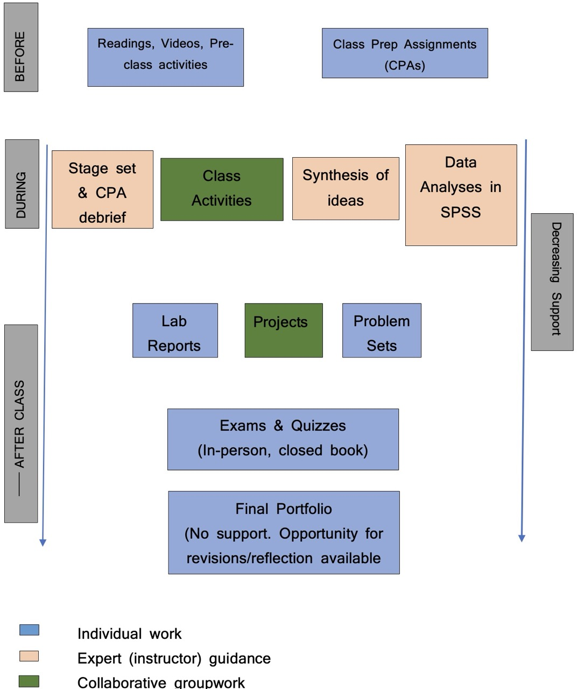

***Instructor:*** Prof. Joash Geteregechi

***Office Location:*** Williams Hall Room 311 E

***Open Hours:***

- Mon: 9.00 am-10.00 am, 12.00 - 1.00 pm (walk-ins allowed);

- Fri: 12.00 - 1.00 pm (walk-ins allowed).

- Fri: 1.00-2.00 pm (Math Support Center, Will 209)

- More hours (virtual) may be available. Please check here: [appointment](https://calendly.com/jmochogi/20min).

***Course Website:*** [Click here]().

### [Meeting Times and Location]{style="color:#20B2AA;"}

Class meets at the following times:

| Day       | Room/Hall         | Time           |
|-----------|-------------------|----------------|
| Monday    | Williams Hall 203 | 2:00 - 2:50 pm |
| Wednesday | Williams Hall 203 | 2:00 - 2:50 pm |
| Thursday  | Williams Hall 203 | 2:00 - 2:50 pm |
| Friday    | Williams Hall 203 | 2:00 - 2:50 pm |

### [Catalog Description]{style="color:#20B2AA;"}

Introduction to the computation and interpretation, application, and communication of basic descriptive and inferential statistics used in the behavioral sciences. Emphasis is placed on analyzing data using SPSS. Prerequisites: Math group 3 or higher, math placement assessment score of 46 or greater; PSYC 10300 or PSYC 10400. 4 Credits.

### [Prerequisites and Credits]{style="color:#20B2AA;"}

Math placement in group 3 or higher, math placement assessment score of 46 or greater, or [PSYC 10300](https://catalog.ithaca.edu/undergrad/coursesaz/psyc/), or [PSYC 10400](https://catalog.ithaca.edu/undergrad/coursesaz/psyc/).

### [Course Format and Philosophy]{style="color:#20B2AA;"}

This class will mostly be taught using a Flipped Model. A flipped classroom is aimed at increasing your engagement and learning by having you complete some activities (readings and/or videos) ahead of class. At the end of each pre-class activity, you will complete a short quiz that we will call class preparation assignment (CPA). The Quiz is straight forward and its answers are, in most cases, directly available in the course material. When doing CPAs, you should write down your notes and any questions that you have so we can address them in class or during open hours. More information about the CPA is provided under Assessment section of this syllabus. Here are some benefits associated with using Flipped Classroom Models:

- ***Independent Learning Skills:*** not everything you learn in school will be applicable **directly** in your job or in the real world. In most cases, you need to transfer your knowledge to new contexts and that often involves new learning (often on your own). A flipped class model sets you up for success as an independent learner. You will learn how to learn on your own.

- ***Active Learning:*** In a flipped classroom, you will be actively engaged in the learning process. You will be asked to think, to write, to discuss, to solve problems, to analyze, to create, to evaluate, and to apply. This is a much more effective way to learn than passively listening to a lecture.

- ***Catching up:*** If you miss a given class and you had completed your CPA, that means you will still have some understanding of the basic ideas. You do not miss out entirely and that means catching up is easier.

{fig-align="center" width="600"}

**Workload Expectation:**

This is a 4 credits course. Credit is earned at Ithaca College in credit hours as measured by the Carnegie unit. The Carnegie unit is defined as one hour of classroom instruction and two hours of assignments outside the classroom, for a period of 15 weeks for each unit (credit).

### [Student Learning Objectives]{style="color:#20B2AA;"}

Upon successful completion of this course, students will be able to:

- Perform and interpret basic descriptive and inferential statistical analyses used in behavioral science research.

- Use the results of statistical analyses to draw reasonable conclusions about research questions.

- Demonstrate the ability to explain statistical information presented in various forms (e.g., symbols, graphs, tables, words)

- Use APA format to communicate the results of statistical analyses conducted to answer research questions.

- Select the appropriate statistical analyses required to answer behavioral science research questions.

- Distinguish between statistical and practical significance.

- Use SPSS to conduct statistical analyses to answer a research question, as well as interpret the results.

## [Course Resources]{style="color:#20B2AA;"}

### [Textbooks]{style="color:#20B2AA;"}

We will use the following text in this course. You may purchase an electronic or physical copy of the book. MindTap purchase is not required, but you may choose to purchase it to get access to more practice problems.

- Gravetter, F.J, Wallnau, L.B., Forzano, L.B. & Witnauer, J,E. (2021/2018). ***Essentials of Statistics for the Behavioral Sciences*** (10th Ed). Boston, MA: Cengage.

Note: We will cover most of the chapters in this book, and homework assignments will be drawn from the end-of-chapter exercises. You do not need to purchase your own copy if you prefer to share one with a friend. You may also rent the book or buy a digital version. A physical copy may be the most convenient, but the choice is up to you. The purchase link is available below:

[Textbook Link](https://ithaca.textbookx.com/institutional/index.php?action=browse&utm_source=Klaviyo&utm_medium=email&utm_campaign=081926_FA26_Faculty_T50_S1_PRO_W_Single_Syllabus#/books/5407443/)

### [Computing:]{style="color:#20B2AA;"}

The primary software we will use in this course is IBM SPSS Statistics. You will need a computers enabled with SPSS for labs. You will also need to access SPSS to finish lab or class assignments. There are two ways to access SPSS:

- Most computers in our classroom (Williams 203) have SPSS pre-installed. Whenever you need the software, you can sign in using your IC credentials.

- If you choose, you can purchase a Student Version of the SPSS Statistics GradPack Base that will last for 6 months. HOWEVER: You must first register with [OnTheHub](https://onthehub.com/spss) first – and your email will be used to verify that you are a student. After that (there may be a short one day delay) you can then order the SPSS software. The cost for this download is approximately \$37.90. Follow the link below:

- **Optional:** You may want to have a scientific calculator (one that has the ability to compute powers–e.g., $(1.675)^3)$\$(1.675)\^3)\$\$(1.675)\^3)\$ to use when you want to do quick calculations in class or during Quizzes. Calculators on devices such as cellphones or iPads will not be allowed during Quizzes and exams.

## [Assessment]{style="color:#20B2AA;"}

Your learning will be assessed in a variety of ways, including Attendance and Participation (AP), Class Preparation Assignments (CPAs), Online Homework, Quizzes, Labs, Midterm Exams, Projects, and a Final Portfolio. Details on each of these components are provided below.

### [Attendance & Participation (AP)]{style="color:#20B2AA;"}

You’re expected to attend all classes and participate during class discussions. Consistent attendance and participation are strong indicators of success in PSYC 207. You will be responsible for all course material, announcements, quizzes, and exams made in class, whether you attended that day’s class or not. I may post the announcements and materials on Canvas and/or send them out as emails. If you anticipate needing to miss more than **four class sessions**, please plan to meet so we discuss your options. Your attendance & participation will be gauged based on the following metrics:

- ***Punctuality***: arrive on time.
- ***Preparedness***: Complete the pre-class work such as readings, listening to podcast, watching videos, and the class prep assignments (CPAs).
- ***Engagement***: Includes sharing your thoughts during class discussions, responding to other students' ideas, contributing to small group collaborative work, contributions to Canvas discussion forums, etc.

### [Class Preparation Assignments (CPAs)]{style="color:#20B2AA;"}

CPAs are done ***prior*** to class. They involve completing short readings or activities and/or watching videos then answering a few questions based on the covered material. CPA's are meant to get you prepared for the material of the week/day so that you can contribute meaningfully during class discussions. For this reason, deadlines for CPAs cannot be extended.

### [Labs]{style="color:#20B2AA;"}

You will complete a lab assignment (using SPSS) almost every week during the semester. These labs will target material of the week or previous week and are meant to give you experience using SPSS software and interpreting software outputs in APA format. Most datasets will be drawn from psychology contexts.

The lowest lab grade will be dropped at the end of the semester.

### [Quizzes]{style="color:#20B2AA;"}

There will be a short quiz (10–15 minutes) in class almost every week, usually on Fridays. The quiz will be based mainly on material covered in the CPAs and/or discussed in class during the current or previous week. To do well on these quizzes, you should complete your CPAs accurately and attend class regularly. If there are concepts you have questions about, be sure to ask. All quizzes will be closed book and closed notes, but you will be allowed to bring a one-page, A4-sized notes/formula sheet for your own use. Do not simply write down formulas or notes without understanding them and how to interpret the results. Drawing insights from statistical analyses is as important as, if not more important than, being able to run the analyses. The lowest quiz grade will be dropped at the end of the semester.

### [Problem Sets]{style="color:#20B2AA;"}

I will assign selected homework problems from the textbook chapters. I strongly recommend working through these problems as we cover the corresponding material in class. Even for multiple-choice questions, you must show and explain all work to justify your answer choice.

### [Projects]{style="color:#20B2AA;"}

There will be two group projects for this class. These projects will be open-ended, providing you with opportunities to showcase your creativity in data analysis, insight generation, and report writing in APA format. Your group will have 10–15 minutes to present your work in class. It is essential that each group member takes an active part in the project work and presentation. Detailed information about the project, including a grading rubric, will be available on the course website under Projects.

### [Midterm Exams]{style="color:#20B2AA;"}

There will be two mid-term exams during the semester. A review session will be held in class a day before each exam. The review session is optional but you are highly encouraged to attend.

The exams will focus heavily on conceptual understanding of the course content and applications as opposed to execution of statistical procedures.

### [Final "Exam" (Portfolio & Presentation)]{style="color:#20B2AA;"}

The final "exam" for this course will have two parts:

a.  **Final Portfolio:** A portfolio with the following:

- Revised work (if necessary) on both mid-term exams. Again, you should point out the errors on every problem and explain how your revisions fix your errors. Exam revisions will be due one week after the exams are returned.
- A reflective essay on your main takeaways from the course and how you may implement that knowledge in your field or other real-life situations. The essay will be due on Thursday, 12/10/2026 by 10.00 PM.

b.  **Oral Presentation:** You will be required to give a 10-minute oral presentation on a question related to the course content. This will be an individual presentation and you may be expected to use SPSS to perform analyses. The question will be sent to you about 24 hours before your scheduled presentation time and solutions must be submitted to Canvas by 8.00 am on the day of the presentation. You should be prepared to answer questions from your peers and/or the instructor.

More information on the Final "Exam" will be provided later in the semester.

### [Grading Policy]{style="color:#20B2AA;"}

Your final letter grade in the course will be weighted by category as follows:

| Category                      | Percentage |
|-------------------------------|------------|
| Attendance and Participation  | —          |
| Class Preparation Assignments | 05%        |
| Labs                          | 10%        |
| Quizzes                       | 10%        |
| Problem Sets                  | 10%        |
| Midterm Exams                 | 30%        |
| Projects                      | 20%        |
| Final Portfolio               | 15%        |

The final letter grade will be determined based on the following thresholds. The instructor reserves the discretion to round your grade up to the next letter grade if your attendance and participation were good throughout the semester.

| Letter Grade | Final Course Grade |
|--------------|--------------------|
| A            | $\ge$ 93           |
| A-           | 90 - 92.99         |
| B+           | 87 - 89.99         |
| B            | 83 - 86.99         |
| B-           | 80 - 82.99         |
| C+           | 77 - 79.99         |
| C            | 73 - 76.99         |
| C-           | 70 - 72.99         |
| D+           | 67 - 69.99         |
| D            | 63 - 66.99         |
| D-           | 60 - 62.99         |
| F            | $<$ 60             |

## [Course policies]{style="color:#20B2AA;"}

### [Academic Honesty]{style="color:#20B2AA;"}

The point is very simple - [you should not cheat]{style="color:red"}. You should not present "someone" else’s work (including generative AI) as your own.

Abide by the following guidelines:

- **Collaboration:**

  - Work that is not assigned as a collaborative assignment should not be completed collaboratively. This does not mean you should not seek support from peers. If you seek support from your peers, be sure that you write your own solutions, otherwise the work will be similar and flagged for cheating. Submitting similar work will be considered a violation of the academic integrity policy by all students involved.
  - For team assignments (e.g., projects), you may collaborate freely within your team. Each group will submit one document contained agreed upon responses. No multiple file submissions.\
  - On individual assignments you may not directly share work with another student in this class, and on team assignments you may not directly share work with another team in this class.

- **Online resources:** In this century, the internet is a go to place for many things. While much of the information on the internet is useful, I expect that you will use it responsibly. The course policy is that you may use online resources (e.g., [StackOverflow](https://stackoverflow.com/), [Wolfram Alpha](https://www.wolframalpha.com/), etc.) but you must explicitly cite where you obtained any solutions you directly use (or use as inspiration).

- **Use of generative artificial intelligence (AI)**: Generative AI tools such as ChatGPT should be treated as other online resources. There are two guiding principles that govern how you can use AI in this course:

  - *Cognitive dimension:* Using AI tools should make you more efficient and productive rather than hampering your ability to think clearly and critically.

  - *Ethical dimension:* Students using AI should be transparent about their use and make sure it aligns with academic integrity. You are ultimately responsible for the work you turn in; it should reflect your understanding of the course content.

  - **✅ AI tools for labs:** You may use AI to find step-by-step procedures for performing certain analyses in SPSS, but be sure to implement them in the software yourself. You will be required to submit your software outputs to demonstrate that you actually performed the analyses. You should not use AI to write the interpretations of your analyses — this part is best done by a human.

  You may use [these guidelines](https://www.monash.edu/student-academic-success/build-digital-capabilities/create-online/acknowledging-the-use-of-generative-artificial-intelligence) for citing AI-generated content.

  - **❌ AI tools for narrative:** You should not use generative AI tools such as ChatGPT to write narrative on assignments. Interpretation of software output, writing up the project report, among others should be written by a human (YOU). If you want to use these tools to check your grammar, you should feel free to do so but be sure to disclose and cite it accordingly.

If you are unsure if the use of a particular resource complies with the academic honesty policy, please contact your instructor.

### [Late Work]{style="color:#20B2AA;"}

The due date & time for all assignments will be posted on Canvas and/or emailed out and/or announced in class. To enable me to prepare for class meetings and give you timely feedback, [I will not accept late work]{style="color:red"} except under extreme circumstances. If you know that you won’t be able to turn in an assignment on time, reach out to me in writing (email) at least one day before the due date to discuss your options. Note that there will be [no extensions on CPA's]{style="color:red"}, but exemptions may be possible if you have a genuine reason for missing a CPA.

### [Mobile devices & Other Technologies]{style="color:#20B2AA;"}

Technology devices (e.g., computers, tablets) may be used in class only for course-related purposes, such as data analysis, writing reports, completing OneNote activities, and similar tasks. However, there will be times — such as during brief interactive discussions or paper-based activities — when students will be required to put away or turn off their devices. Using these devices for non-course-related purposes is prohibited. Research shows that such use distracts not only you but also your classmates. Violations of this policy will hurt your attendance and participation score. per week will result in a score of 0 on the next attendance and participation grade. Persistent violations may necessitate further action to prevent continued disruption to other students.

### [Teams]{style="color:#20B2AA;"}

From time to time, this class will run through small group work (teams). You will be randomly assigned to a team at the start of the semester. About midway into the semester, I will switch people teams based partly on my professional judgement. I will allow you to suggest members you would like to work with but there are no guarantees that you will get grouped with all members of your choice. I generally seek to have mixed ability teams and to ensure that everyone has a chance to work with different people.

## [Getting Support]{style="color:#20B2AA;"}

There are various resources available to help you succeed in this course. Should you feel like you are struggling, please don’t hesitate to reach out to me so we can discuss possible ways forward. Below are some academic support services available to you.

### [Open Hours]{style="color:#20B2AA;"}

I will be available during open hours (Mon 9-10 am; 12.00 - 1.00 pm, Fri 12-1) to answer questions or concerns that you may have in the course. You can simply walk in during the stated time above. More times may be available but you will need to check my schedule on [this link](https://calendly.com/jmochogi/20min?month=2024-08). Open hours may be held in-person or virtually depending on circumstances of the day. Below are the zoom link and passcode for virtual meetings:

**Zoom Link:** <https://ithaca.zoom.us/j/3364817575?pwd=WlA1S3hJWWZNTTFoWUVaZlA1clhtdz09>

**Passcode:** 850 424

### [Math Tutoring Sessions]{style="color:#20B2AA;"}

The mathematics department is committed to the success of all students enrolled in mathematics courses. Free one-on-one support for your mathematics coursework is available during select daytime and evening hours Monday-Friday at the Mathematics Room (Williams Hall 209). The Mathematics Room is staffed by mathematics faculty and vetted students. Student tutors offer support to fellow students in courses numbered 200 and below while math faculty offer support in any of the math courses. For more information and the schedule, please visit the [Math Support Center](https://www.ithaca.edu/academics/school-humanities-and-sciences/mathematics/courses-placement-resources/mathematics-support-center).

### [Tutoring & Academic Enrichment Services]{style="color:#20B2AA;"}

As a supplement to faculty advising and office hours, Tutoring and Academic Enrichment Services offers exceptional peer resources free of charge. Learning Coaches provide content-specific peer tutoring in a variety of courses. Peer Success Coaches mentor students who wish to develop collegiate-level academic and social engagement skills. To access these courses and for more information, please visit the [Center for Student Success](https://www.ithaca.edu/tutoring-services).

### [Writing Center]{style="color:#20B2AA;"}

The Writing Center aims to help students from all disciplines, backgrounds, and experiences to develop greater independence as writers. We are committed to helping students see writing as central to critical and creative thinking. The physical location in Smiddy 107 will not be open to clients. For more information and scheduling appointments please visit the [writing center website](https://ithaca.mywconline.com).

## [Tips for Success]{style="color:#20B2AA;"}

Here are a few basic suggestions for how to succeed in this course:

### [Keep up with Homework]{style="color:#20B2AA;"}

It is essential that you understand how to solve the assigned homework problems and exercises, and more importantly, how and why the skills and techniques covered in the course are used to solve them. I recommend that you begin working on the homework as soon as possible. Avoid leaving your homework until the last minute or working close to the deadline. Completing the homework on time allows you to receive timely feedback, which will help you better understand the material and perform well in other assessment categories such as exams.

### [Attend Class Regularly]{style="color:#20B2AA;"}

As noted earlier, attendance is a critical part of your success in this course. You should try to attend every class because it is during class time that we will delve deeper into the course material and practice with applications.

### [Stay Caught Up]{style="color:#20B2AA;"}

Most concepts in this course build on each other cumulatively and you need to stay on top of the material at every stage. If you are having difficulty, don’t expect that the problem will take care of itself and disappear later. Contact me immediately and discuss the problem.

### [Collaborate with Peers]{style="color:#20B2AA;"}

Many students benefit from sharing their work with others or by having their work questioned by their peers. You should attempt homework problems ahead of time by yourself and then note down any difficulties/questions that you can discuss with your peers. Even if you have no difficulties, you may still learn different and perhaps more efficient ways of solving the same problem during collaborative work. Below are some of the ways through which you can do this: - **Canvas Discussion Forums & One Note Collaboration Space** - You can post questions and answer others' questions here. I encourage you to scan hand-written work (if necessary) and upload it alongside your question so people can see how you are thinking.

- **Zoom sessions** – If you cannot meet in person, you can initiate Zoom sessions for collaborating. Zoom whiteboards are available to write on or you may simply have discussions. You can record these for later playback. If you want to invite me to your Zoom session, please send me an email with the link ahead of time and I will let you know if I am available to join.

## [College-wide Policies]{style="color:#20B2AA;"}

### [Attendance Policy]{style="color:#20B2AA;"} {#attendance-policy}

Students at Ithaca College are expected to attend all classes, and they are responsible for work missed during any absence from class. At the beginning of each semester, instructors must provide the students in their courses with written guidelines regarding possible penalties for failure to attend class. These guidelines may vary from course to course but are subject to the following conditions:

- In accordance with Federal Law, students with a disability documented through Student Accessibility Services (SAS) may require reasonable accommodations to ensure equitable access. A student with an attendance accommodation, who misses a scheduled course time due to a documented disability, must be provided an equivalent opportunity to make up missed time and/or coursework within a reasonable time-frame. An accommodation that affects attendance is not an attendance waiver and no accommodation can fundamentally alter a course requirement. If a faculty member thinks an attendance-related accommodation would result in a fundamental alteration, concerns and potential alternatives should be discussed with SAS.
- In accordance with New York State law, students who miss class due to their religious beliefs shall be excused from class or examinations on that day. The faculty member is responsible for providing the student with an equivalent opportunity to make up any examination, study, or work requirement that the student may have missed. Any such work is to be completed within a reasonable time frame, as determined by the faculty member.
- Any student who misses class due to a family or individual health emergency or to a required appearance in a court of law shall be excused. If the emergency is prolonged or if the student is incapacitated, the student or a family member/legal guardian should report the absence to the Dean of Students or the Dean of the academic school where the student’s program is housed. Students may consider a leave of absence, medical leave of absence, selected course withdrawals, etc., if they miss a significant portion of classwork. (Note: Graduate students may not take a leave of absence.)
- A student may be excused to participate in local, state, or federal elections. The student is responsible to make up any work that is missed due to the absence. Any such work is to be completed within a reasonable time frame, as determined by the faculty member.

A student may be excused for participation in College-authorized co-curricular and extracurricular activities if, in the instructor’s judgment, this does not impair the specific student’s or the other students’ ability to succeed in the course. For all absences except those due to religious beliefs, the course instructor has the right to determine if the number of absences has been excessive in view of the nature of the class that was missed and the stated attendance policy.

Students should notify their instructors as soon as possible of any anticipated absences.

### [Student Accessibility Services]{style="color:#20B2AA;"}

In compliance with Section 504 of the Rehabilitation Act of 1973 and the Americans with Disabilities Act, reasonable accommodation will be provided to students with documented disabilities on a case-by-case basis. Students must register with [Student Accessibility Services](https://elbert.accessiblelearning.com/Ithaca/ApplicationStudent.aspx) and provide appropriate documentation to Ithaca College before any academic adjustment will be provided. Please note that accommodations are not retroactive, so timely contact with Student Accessibility Services is encouraged. To discuss accommodations or the accommodation process, students should schedule to meet with a SAS specialist. 607-274-1005 \| sas\@ithaca.edu.

### [Mental Health statement]{style="color:#20B2AA;"}

The Ithaca College [Center for Counseling and Psychological Services](https://www.ithaca.edu/center-counseling-psychological-services) (CAPS) promotes and fosters the academic, personal, and interpersonal development of Ithaca College students by providing short-term individual, group, and relationship counseling, crisis intervention, educational programs to the campus community, and consultation for faculty, staff, parents, and students. Their team of licensed and licensed-eligible professionals value inclusivity, and they are dedicated to creating a diverse, accessible, and welcoming environment that is safe and comfortable for all those they serve and with whom they interact. CAPS sees students in-person at their offices in the Hammond Health building (side entrance), but Telehealth meetings through Zoom can be arranged in some circumstances. Staff in the office will answer questions by phone at 607-274-3136; please leave a voicemail if you do not reach a live person. You can also reach the office via email at counseling\@ithaca.edu. CAPS hours remain Monday-Friday 8:30 a.m. to 5:00 p.m. After-hours connections to a live counselor are available by calling the CAPS number and following the prompts.

In the event I suspect you need additional support, expect that I will express to you my concerns. It is not my intent to know the details of what might be troubling you, but simply to let you know I am concerned and that help, if needed, is available. Remember, getting help is a smart and courageous thing to do.

### [Academic Integrity]{style="color:#20B2AA;"}

The College is an academic community, which values academic integrity and takes seriously its responsibility for upholding academic honesty. All members of the academic community have an obligation to uphold high intellectual and ethical standards. All forms of dishonesty including cheating and plagiarism are unacceptable. Failure to appropriately cite material used in a paper is plagiarism. The minimum penalty for cheating or plagiarism is a zero for the test or paper in question. Referral to college judiciaries is also possible. For more information on academic integrity and academic dishonesty, please refer to the [Student Handbook](https://www.ithaca.edu/student-affairs-and-campus-life/student-handbook), the College Catalog and the [Code of Student Conduct](https://www.ithaca.edu/policy-manual/volume-vii-students/71-general-student-policies/712-student-conduct-code) and Related Policies or ask your instructor.

### [Title IX Information]{style="color:#20B2AA;"}

At Ithaca College, we believe that every individual has the right to be treated with respect and dignity and we support the creation and maintenance of a safe and positive living and learning environment. Students who experience sexual violence (including dating violence, stalking and sexual assault), sexual harassment, or discrimination based on gender or sexual identity) are encouraged to report their experience to the Title IX Coordinator, lkoenig\@ithaca.edu to explore formal and informal reporting options, and explore the support and resources available. The Title IX Coordinator will work with you to determine the best way to proceed and enhance the safety of our community. For more information go to: <https://www.ithaca.edu/share>.

Information shared in class assignments, class discussions, and at public events do not constitute an official disclosure, and faculty and staff do not have to report these to the Title IX Coordinator. Faculty and staff should be sure that access to campus and community resources related to sexual misconduct are available to students in the case these subjects do arise. Any other disclosure to faculty and staff can be reported to the Title IX Coordinator.

### [Academic Advising Center]{style="color:#20B2AA;"}

Students are asked to consult with their faculty advisor, or the advising contact within their school, for all advising matters. Faculty advisors will be able to assist students with most advising questions, or they may collaborate with the dean's office for more complicated matters. Students can find the name of their assigned faculty advisor in Homer or in Degree Works.

### [Diversity and Inclusion]{style="color:#20B2AA;"}

Ithaca College values diversity because it enriches our community and the myriad experiences that characterize an Ithaca College education. Diversity encompasses multiple dimensions, including but not limited to race, culture, nationality, ethnicity, religion, ideas, beliefs, geographic origin, class, sexual orientation, gender, gender identity and expression, disability, and age. We are dedicated to addressing current and past injustices and promoting excellence and equity. Ithaca College continually strives to build an inclusive and welcoming community of individuals with diverse talents and skills from a multitude of backgrounds who are committed to civility, mutual respect, social justice, and the free and open exchange of ideas. We commit ourselves to change, growth, and actions that embrace diversity as an integral part of the educational experience and of the community we create.Please learn more about Ithaca College’s commitment to diversity, equity and inclusion: <https://www.ithaca.edu/diversity-and-inclusion/diversity-statement>.

## [Sexual Harassment and Assault Response & Education (SHARE)]{style="color:#20B2AA;"}

Please note that if you disclose an experience related to sexual misconduct (including sexual assault, dating violence, and/or stalking, sexual harassment or sex-based discrimination, your professor is obligated to inform the Title IX coordinator, Linda Koenig (lkoenig\@ithaca.edu), of all relevant information, including your name. The college will take initial steps to address the incident(s), protect, and, support those directly affected, and enhance the safety of our community. The Title IX coordinator will work with you to determine the best way to proceed. Information shared in class assignments, class discussions, and at public events do not constitute an official disclosure, and faculty and staff do not have to report these to the Title IX Coordinator. Faculty and staff should be sure that access to campus and community resources related to sexual misconduct are available to students in the case these subjects do arise. Any other disclosure to faculty and staff needs to be reported to the Title IX Coordinator. For more information: <https://www.ithaca.edu/share>.

## [Religious Observance]{style="color:#20B2AA;"}

At Ithaca College, we uphold diverse religious and spiritual traditions - each with its own set of beliefs, practices, and observances that are part of our community. If you anticipate needing accommodations for attending class, taking exams, or submitting assignments due to a religious observance, you can work directly with me to accommodate your needs. Please share the potential dates with me as soon as possible so we can plan for your success in our class. The Office of Religious and Spiritual Life is also available to support you as you navigate your religious observances at IC. If you have questions or suggestions, please contact the Office of Religious and Spiritual Life at spirituallife\@ithaca.edu. More information on religious observances and accommodations at IC is available here.

\newpage

## [Important dates]{style="color:#20B2AA;"}

- **Aug 24:** Classes begin.

- **Aug 30:** Last day to Add/Drop course.

- **Oct 21:** Fall Mid-Term Grades Due.

- **Oct 26-27:** Fall Break — No classes.

- **Oct 30:** Last Day to Withdraw with "W" Fall Semester Classes.

- **Nov 25-29:** Thanksgiving Break — No classes.

- **Dec 08:** Last day of classes.

- **Dec 09:** Reading Day.

- **Dec 10:** Final Exams Begin at 7.30 am.

For more information on dates, see the full [Ithaca College Calendar](https://www.ithaca.edu/academics/registrar/academic-calendars/2026-2027-academic-calendar).
