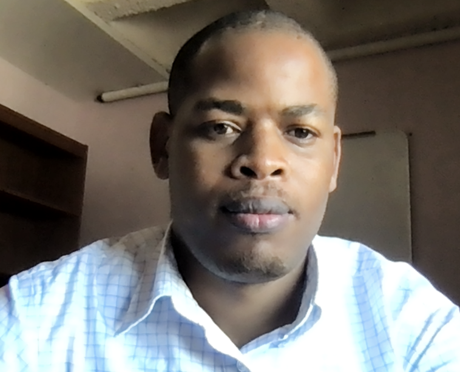
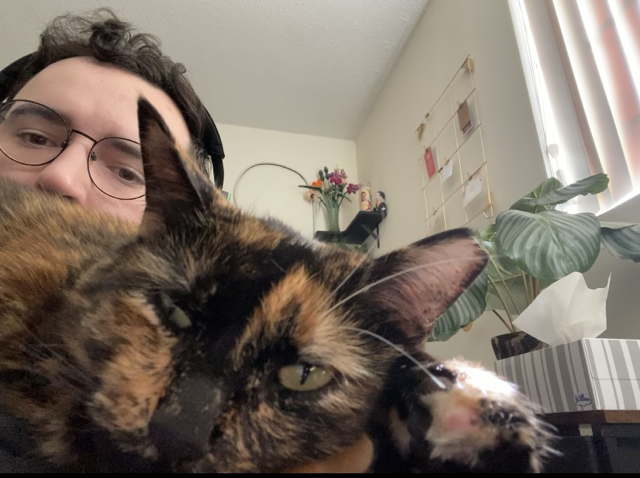
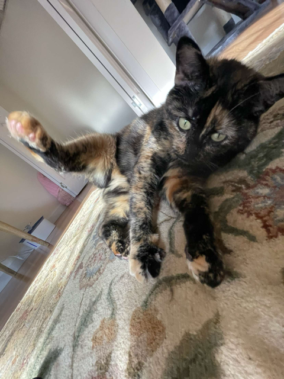
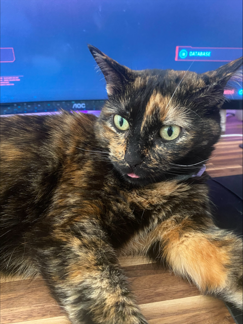
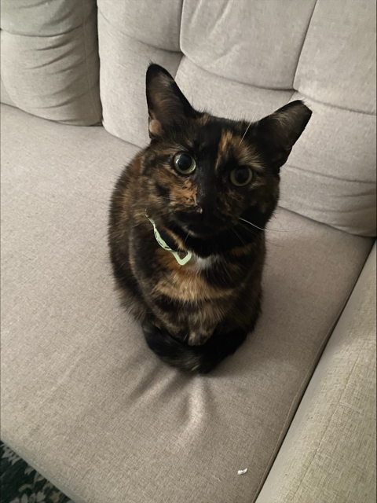

# Overview

Learn approaches for analyzing data drawn from psychology settings, such as surveys and experiments, emphasizing statistical inference via hypothesis testing and parameter estimation. This class emphasizes data analysis using a popular data analysis software known as SPSS — Statistical Product and Service Solutions.

# Class Meetings

|             |                      |                |
|-------------|----------------------|----------------|
| **Lecture** | Mon 02:00 - 02:50 pm | Williams 208 E |
| **Lecture** | Wed 02:00 - 02:50 pm | Williams 208 E |
| **Lab**     | Th 02:00 - 02:50 pm  | Williams 208 E |
| **Lecture** | Fri 02:00 - 02:50 pm | Williams 208 E |

# Teaching Team

### Instructor

{style="float:right;padding: 0 0 0 10px;" fig-alt="Dr. Joash Geteregechi Headshot" width="200"}

[Joash Geteregechi](https://www.ithaca.edu/faculty/jgeteregechi) is an Associate Professor in the Department of Mathematics at Ithaca College in Ithaca, New York. He is originally from [Kenya](https://ktb.go.ke), a country located in eastern part of Africa. Joash earned his PhD in mathematics education in 2020 from Syracuse University in Syracuse, New York and joined Ithaca College in the same year. His work is in mathematics education with a focus on understanding undergraduate students' mathematical reasoning.

| Office hours | Location |
|------------------------------------|------------------------------------|
| M: 9-10.00 am | Williams 311E |
| MWF: 12:00 - 1:00 pm | Williams 311E |
| F: 1:00 - 2:00 pm | Williams 209 |
| *or by [appointment](https://calendly.com/jmochogi/20min?month=2026-08).* |  |

## Teaching Assistant

The Teaching Assistant (TA) for this class is Andrew Burkhardt (you can call him Andrew). Andrew is pursuing a bachelor’s degree in psychology with a minor in neuroscience. He transferred to Ithaca College last year and is now in his senior year. His future goal is to become a clinical psychologist.

Andrew loves cats and has one called Maple! Here are some photos:

::: {layout-ncol=3}

:::

::: {layout-ncol=3}

:::
