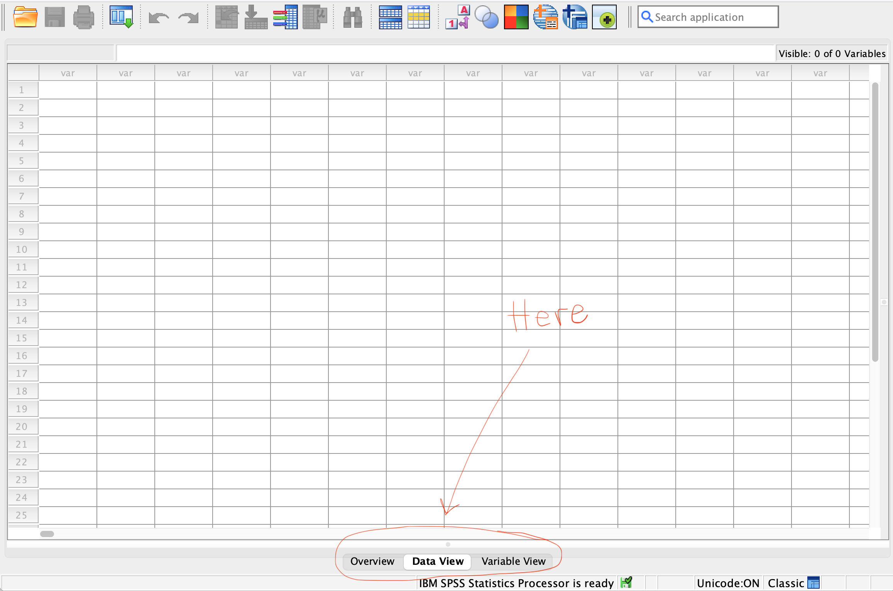
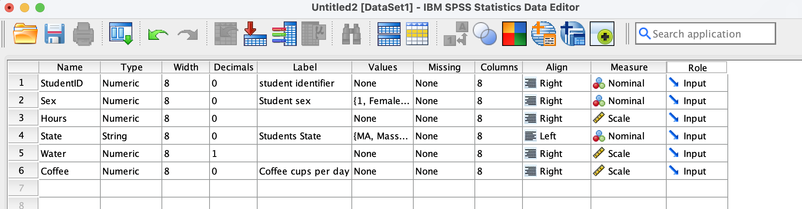
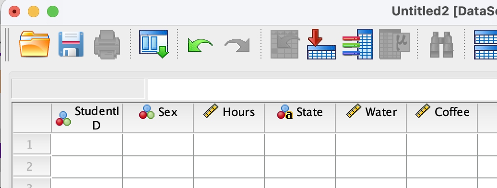

**Before you start:** Open SPSS Statistics on your lab computer or personal computer if you have the software installed. When it opens, you may see a "What's New" or "Welcome" dialog box — close it. You should be looking at a blank **Data Editor** window with a grid of empty cells.

------------------------------------------------------------------------

## Part 0: SPSS Interface

Look at the bottom of the SPSS window. You'll see **Data View** and **Variable View** options. See below:

{fig-align="center" width="1000"}

- **Data View** — this is where you type in the data/scores. Each row represents **one** individual and each column represents **one** variable.
- **Variable View** — this is where you describe each variable *before* you enter any scores.

There is also a separate window called the **Output Viewer** — it doesn't exist yet, but it will pop up automatically the first time you run an analysis (not today!). That's where your results/tables/graphs etc appear.

**Rule for today:** we always set up a variable in **Variable View** *before* typing any scores for it in **Data View**. This mirrors Chapter 1's point that researchers must define how something will be measured (operationalized) before they collect data.

------------------------------------------------------------------------

## Part 1: Entering Variables

You're going to enter data from a classroom mini-survey of 8 students (the survey we conducted yesterday).

- Click the **Variable View** tab. You'll see rows (one per variable) and columns including **Name**, **Type**, **Decimals**, **Label**, **Values**, and **Measure**.

- Follow the following steps to enter the variables:

### Row 1: StudentID

1.  Click the first empty cell in **row 1, "Name" column**. Type: `StudentID`
2.  Leave **Type** as the default (Numeric).
3.  Click the **Decimals** cell for this row. Change it to `0` (an ID number has no decimal places).
4.  Click the **Label** cell. Type: `Student identifier`
5.  Click the **Measure** cell. Click the dropdown arrow and select **Nominal**.
    - *Why nominal?* An ID number is just a name written as a digit — Student #7 isn't "more" than Student #3. This is exactly the room-number example from the textbook: room numbers are labels, not quantities.

### Row 2: Sex

1.  **Name:** `Sex`
2.  **Decimals:** `0`
3.  **Label:** `Student's sex`
4.  **Values:** Click the Values cell, then click the small gray **…** button that appears on the right side of the cell. A "Value Labels" dialog opens. Click the `+` sign to add values.
    - In the **Value** box, type `1`. In the **Label** box, type `Female`. Click **Add**.
    - Value `2`, Label `Male`. Click **Add**.
    - Value `3`, Label `Other`.
    - Click **OK**.
5.  **Measure:** select `Nominal`.

### Row 3: Hours

1.  **Name:** `Hours`
2.  **Decimals:** set to `0`
3.  **Label:** `Number of hours slept`
4.  **Measure:** select `Scale`.

### Row 4: Coffee

1.  **Name:** `Coffee`
2.  **Decimals:** set to `0`
3.  **Label:** `Coffee cups per day.`
4.  **Measure:** select `Scale`.

### Row 5: State

1.  **Name:** `State`
2.  **Type:** Click on the grey three `...` dots on the right of the cell then choose `String`. The string string option allows you to enter non-numeric information. With this option, numerals are interpreted as characters.
3.  **Width:** Use 10.
4.  **Decimals:** `0`
5.  **Label:** `Student's state`
6.  **Values:** Click the Values cell, then click the three **…** dots that appears on the right side of the cell. A "Value Labels" dialog opens. Click the `+` sign to add values.
    - In the **Value** box, type `NY`. In the **Label** box, type `New York`. Click **Add**.
    - Continue until all states in the data are entered.
    - Click **OK**.
7.  **Measure:** select `Nominal`.

### Row 6: Water

1.  **Name:** `Water`
2.  Type: Leave as `Numeric`
3.  **Decimals:** Use `1` decimal to entries such as 2.5 liters.
4.  **Label:** `Daily water consumption.`
5.  **Measure:** select **Scale**.

If you did everything correctly, your variable view screen should look as follows:

{fig-align="center"}

------------------------------------------------------------------------

## Part 2: Entering the Data

The second step after setting up variables is to enter the data themselves. Click the **Data View** tab on the bottom of the SPSS window. The 6 column headers created (StudentID, Sex, etc) should appear, this time round as columns, as shown below:

{fig-align="center" width="600"}

Now enter the data accordingly. See the class activity for Wed 8/26 in OneNote.

::: {.callout-tip title="Tip"}
In Data View, the Sex variable will still show plain numbers (1, 2, 3) unless you turn on value labels. To check your coding: go to the **View** menu (top menu bar) → **Grid Lines** → click **Value Labels**. The columns should now display the named values instead of numbers. Toggle it back off and on to see both views — the number is what's stored, the label is what humans read.
:::

------------------------------------------------------------------------

## Part 3: Saving and Retrieving Files

**Save your file:** File → Save As → File name it `Lab_0_YourLastName.sav` → save it in a convenient location for you, preferably the desktop.

Now, close the program and try to navigate to the file you just saved. When you find it, double clikc to make sure it is opening at it should. Next time you need this file, this is what you will doRelax and slow down! We will run analyses in the next lab.

## Part 4: Running Analyses

Kudos if you made it this far! In the next lab, we will perform some data analysis (basic descriptive statistics).
