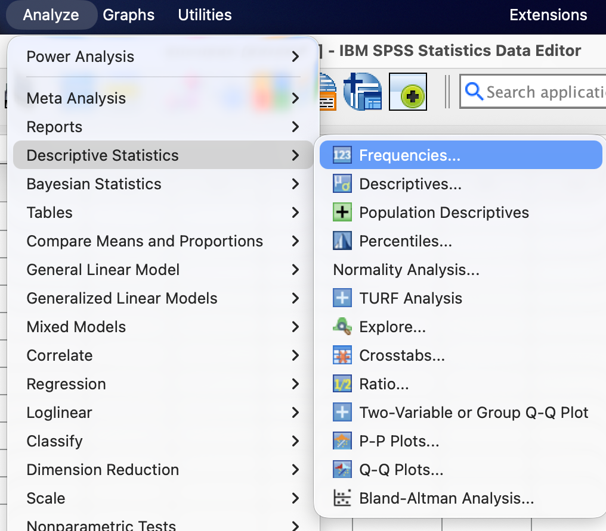
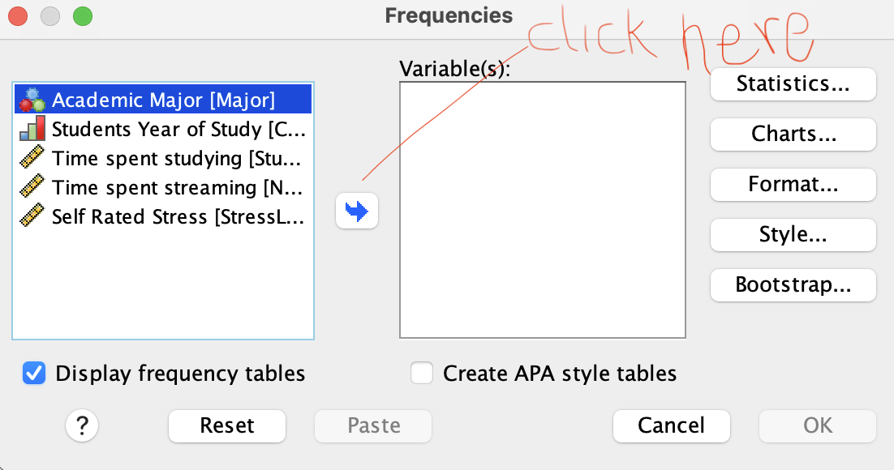
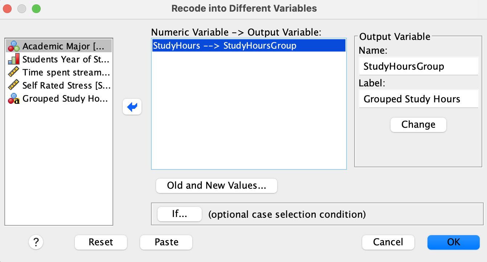
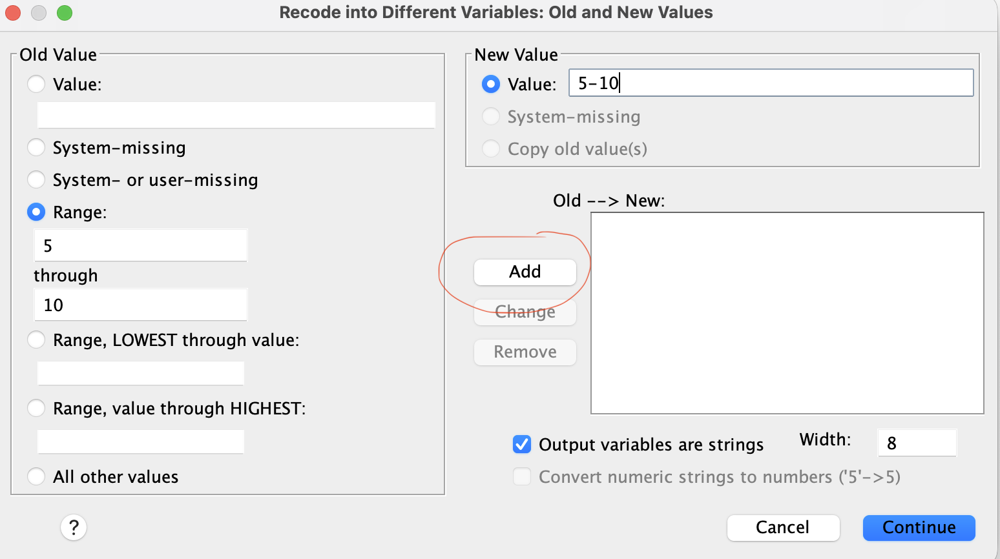

## Overview

In this lab, you will be introduced to methods of data organization and visualization using SPSS. You will learn how to create a dataset, enter data, and generate frequency tables and graphs for both nominal (or ordinal) and scale variables. These are important beginning skills for analyzing data in behavioral sciences.

## Part 1: Build Your Variable View

Open SPSS and create a new dataset. Click the **Variable View** tab and add the following **6 variables**, one per row. For each one, follow these exact steps.

### Row 1: StudentID

1.  Click the empty cell in **row 1, "Name" column**. Type: `StudentID`
2.  Leave **Type** as the default (Numeric).
3.  Click the **Decimals** cell for this row. Change it to `0` (an ID number has no decimal places).
4.  Click the **Label** cell. Type: `Student identifier`
5.  Click the **Measure** cell. Click the dropdown arrow and select **Nominal**.
    - *Why nominal?* An ID number is just a name written as a digit — Student #7 isn't "more" than Student #3.

### Row 2: Major

1.  **Name:** `Major`
2.  **Decimals:** `0`
3.  **Label:** `Academic major`
4.  **Values:** Click the Values cell, then click the small gray **…** button that appears on the right side of the cell. A "Value Labels" dialog should open.
    - Click the `+` sign to show **Value** box, and type `1`. In the **Label** box, type `Psychology`. Click **Add**.
    - Value `2`, Label `Biology`. Click **Add**.
    - Value `3`, Label `Business`. Click **Add**.
    - Value `4`, Label `Undecided`. Click **Add**.
    - Click **OK**.
5.  **Measure:** select **Nominal**.

### Row 3: ClassYear

1.  **Name:** `ClassYear`
2.  **Decimals:** `0`
3.  **Label:** `Year in school`
4.  **Values:** same process as above —
    - `1` = `Freshman`, `2` = `Sophomore`, `3` = `Junior`, `4` = `Senior` (Add after each one, then OK)
5.  **Measure:** select **Ordinal**.
    - *Why ordinal and not nominal?* Unlike majors, Freshman → Senior is an ordered sequence.

### Row 4: StudyHours

1.  **Name:** `StudyHours`
2.  **Decimals:** change to `1` (allow one decimal place, e.g., 8.5)
3.  **Label:** `Hours spent studying per week`
4.  **Values:** leave blank (this variable's numbers are real quantities, not category codes — nothing to label)
5.  **Measure:** select **Scale**.
    - *Why Scale?* This is a continuous variable with a meaningful zero (0 hours studied means no studying at all), so it meets the textbook's definition of a ratio scale. Recall that SPSS collapses `interval` and `ratio` into one category named `Scale`.

### Row 5: NetflixHours

1.  **Name:** `NetflixHrs`
2.  **Decimals:** `1`
3.  **Label:** `Hours spent streaming video per week`
4.  **Values:** leave blank
5.  **Measure:** select **Scale**.

### Row 6: StressLevel

1.  **Name:** `Stress`
2.  **Decimals:** `0`
3.  **Label:** `Self-rated stress, 1 (low) to 10 (high)`
4.  **Values:** leave blank for now — we'll come back to this one in the discussion question below.
5.  **Measure:** select **Scale** for now (we'll revisit whether this is the right call)

::: {.callout-note title="Note on SPSS's Measure column"}
The textbook describes **four** scales of measurement (nominal, ordinal, interval, ratio) but SPSS collapses the last two into one "Scale" category.
:::

------------------------------------------------------------------------

## Part 2: Enter the Data

Click the **Data View** tab. Your 6 column headers (StudentID, Major, etc.) should already be there from Part 1. Type the following, one row per student — click a cell, type the number, press **Tab** or **Enter** to move to the next cell.

| StudentID | Major | ClassYear | StudyHours | NetflixHrs | Stress |
|-----------|-------|-----------|------------|------------|--------|
| 1         | 1     | 2         | 12.5       | 6.0        | 7      |
| 2         | 3     | 4         | 6.0        | 10.5       | 5      |
| 3         | 2     | 1         | 15.0       | 3.5        | 8      |
| 4         | 4     | 1         | 8.5        | 9.0        | 6      |
| 5         | 1     | 3         | 10.0       | 5.5        | 4      |
| 6         | 2     | 4         | 18.5       | 2.0        | 9      |
| 7         | 3     | 2         | 7.5        | 12.0       | 5      |
| 8         | 1     | 4         | 11.0       | 4          | 6      |
| 9         | 4     | 3         | 9.5        | 8.0        | 7      |
| 10        | 2     | 2         | 13.0       | 6.5        | 8      |

::: {.callout-tip title="Tip"}
In Data View, the Major and ClassYear columns will still show plain numbers (1, 2, 3, 4) unless you turn on value labels. To check your coding: go to the **View** menu (top menu bar) → click **Value Labels**. The columns should now display "Freshman", "Sophomore," etc. instead of numbers. Toggle it back off and on to see both views — the number is what's stored, the label is what humans read.
:::

**Save your file now:** File → Save As → name it `Lab_1_YourLastName.sav` → Note the location you saved your file.

------------------------------------------------------------------------

## Part 3: Run Your First Output/Data Analyses

In this section, you'll run two basic analyses in SPSS: a frequency table for a nominal variable, and summary statistics for a scale variable. Note that the output will appear in a separate window called the **Output Viewer** and that this output will have to be saved just like the data file.

### Frequency table for a nominal variable

- Go to the menu bar and click **Analyze → Descriptive Statistics → Frequencies.** See below

  {width="496"}

- In the dialog box on the left, click **Academic Major**, then click the arrow button in the middle to move `Academic Major` into the **Variable(s)** box on the right. Make sure the box that says *"Display Frequency tables"* is checked. See below:

  {width="503"}

- Next, click **OK**.

- The Output Viewer window opens with a table showing how many students fall into each major category, and what percentage each represents.

### Visualizing a Nominal (or Ordinal) Variable

The common tools used to visualize the distribution of nominal or ordinal variables are bar graphs or pie charts. To create a bar graph for the variable Major, follow the steps steps below:

- **Analyze → Descriptive Statistics → Frequencies.** In the dialog box, select **Academic Major** and move it to the **Variable(s)** box.
- Click **Charts** on the right side of the dialog box. In the new dialog box, select **Bar charts** and click **Continue**.
- C **OK**. A bar graph will appear in the Output Viewer. The same procedure can be followed to create a pie chart by selecting **Pie charts** instead of **Bar charts** in the Charts dialog box.

It is often helpful to have percentages displayed on the vertical axis instead of the raw frequencies. To do this, select the `percentages` option under the `Frequency Charts` pop up box (step 2 above).

### Frequency Table for a Scale Variable

We want to create a table that summarizes the variable `StudyHours`. Follow these steps:

- Menu bar: **Analyze → Descriptive Statistics → Frequencies**. If Academic Major is still on the right box, click on it and click the back arrow to move it back to the left.

- Now move **StudyHours** into the "Variable(s)" box as earlier. Make sure the ***Display frequency tables*** box is checked.

- Click **OK**. A frequency table appears in the **Output Viewer** showing each study hour and the corresponding frequency.

::: {.callout-caution title="Caution"}
When working with larger data sets, a frequency table on this kind is not helpful. We can use a grouped frequency table instead. 
Although the grouped frequency table loses some information, it is easier to read and interpret when we have a large number of unique values.
:::

Although our data set is fairly small (n=10), we can still use it to demonstrate the process of creating a grouped frequency table for **StudyHours**, we will begin by transforming the variable to create three bins (5-10, 11-15, 16-20) as follows:

- Menu bar: **tranform → Recode into Different Variable**.

- Move the Variable **StudyHours** into the ***Input Variable → Output Variable*** box as shown below:

  {width="526"}

- In the ***Output Variable*** section under **name**, write `StudyHoursGroup` (no spaces). In the **Label** field, write `Study Hours Group` (spaces allowed) then click **Change**.

- Next, click **Old and New Values**. The following window will appear:

  {width="542"}

- Start by checking the box that says ***Output variables are strings***.

- In the ***Old Value*** section, select **Range** and type `5` in the first box and `10` in the second box as shown in the screenshot above. In the ***New Value*** section, write `5-10`.

- Click **Add**.

- To create the next bin, enter 11 and 15 as earlier, then write `11-15` under **New Value**, then click **Add**. Repeat this for `16-20`.

- Click **Continue** to return to the previous window, then click **OK**.

Take a look at the data window and you should see the new variable you just created called `StudyHoursGroup.`

To create a frequency table, we follow the steps from earlier:

- **Analyze → Descriptive Statistics → Frequencies.**
- Move the variable **StudyHoursGroup** into the "Variable(s)" box. Make sure the ***Display frequency tables*** box is checked. You may want to click on **Charts** and select **None**.
- Click **OK**. A frequency table appears in the Output Viewer showing how many students fall into each study hour group.

### Visualizing a Scale Variable

There are various graphs that can be used to visualize the distribution of a scale variable. The most common ones are histograms, boxplots, dotplots, and stem-and-leaf plots. Histograms are good for showing the shape of the distribution, boxplots are good for showing the shape of the distributions as well as locations of the median, quartiles, and if there are any outliers.

For this lab, we will creat a `histogram` to visualize the distribution of `StudyHours`. Here are the steps:

- Menu bar: **Analyze → Descriptive Statistics → Frequencies.** Move the variable **StudyHours** into the "Variable(s)" box. Uncheck the box ***Display frequency tables*** (we do not need the table).
- Click **Charts** on the right side of the dialog box. In the new dialog box, select **Histograms** and click **Continue**.
- Click **OK**. A histogram appears in the Output Viewer showing the distribution of `StudyHours`.

::: {.callout-tip title="Checkpoint"}
Based on the histogram, what can you say about the distribution of the study hours? Is the histogram roughly symmetric, skewed to the left, or skewed to the right?
:::

**Save your output file:** File → Save As → name it `Lab_1_Output_YourLastName.spv` → Note the location you saved your file.

------------------------------------------------------------------------

## Take-Home Lab Exercises

Answer the following questions based on your SPSS output (more analyses may be required). Include screenshots of the relevant software outputs (e.g., frequency tables, bar graphs, histograms) in your report. Your report should be typed (Times New Roman, Font size 12, double spaced). The lab is graded out of 20 points. Ten points are for the 2 SPSS outputs and ten points are for your written responses to the questions below.

1.  **(Frequency tables, 2 points.)** Create a ***frequency table*** for the variable `ClassYear`. Based on the table, answer the following questions:
    - What is the most common class year(s) among the students in this dataset?
    - What percentage of students are either Freshmen or Sophomores?
2.  **(Bar Graph, 2 points.)** Create a ***bar graph*** for the variable `ClassYear`. Based on the graph, answer the following questions:
    - Which year has the highest number of students?
    - Which year has the lowest number of students?
3.  **(Frequency Tables, 4 points.)** Create a ***grouped frequency table*** for the variable `NetflixHours` using the groups 0-4, 5-9, 10-14. Based on the table, answer the following questions:
    - What is the most common range of hours spent streaming video per week?
    - What percentage of students spend more than 10 hours per week streaming video?
4.  **(Histogram, 2 points.)** Create a ***histogram*** for the variable `NetflixHours`. Based on the histogram, what can you say about the distribution of the hours students spent streaming?

## Submission Checklist

- [ ] A saved SPSS data file (.sav) with correct **variables** alongside their specifications, and correctly entered data.

- [ ] SPSS output file (.spv) showing the analyses performed, including frequency tables, bar graphs, grouped frequency tables, and histograms.

- [ ] Completed responses for Questions 1—4 above. This document should be typed (Times New Roman, Font size 12, double spaced). The document should include screenshots of the relevant software outputs (e.g., frequency tables).

------------------------------------------------------------------------

```{=html}
<!--
## Instructor Notes
:::
-->
```
