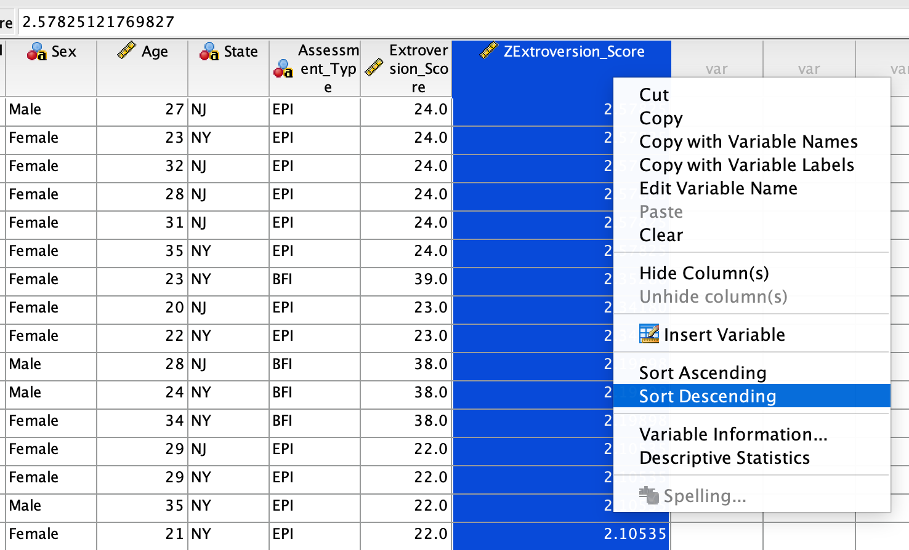
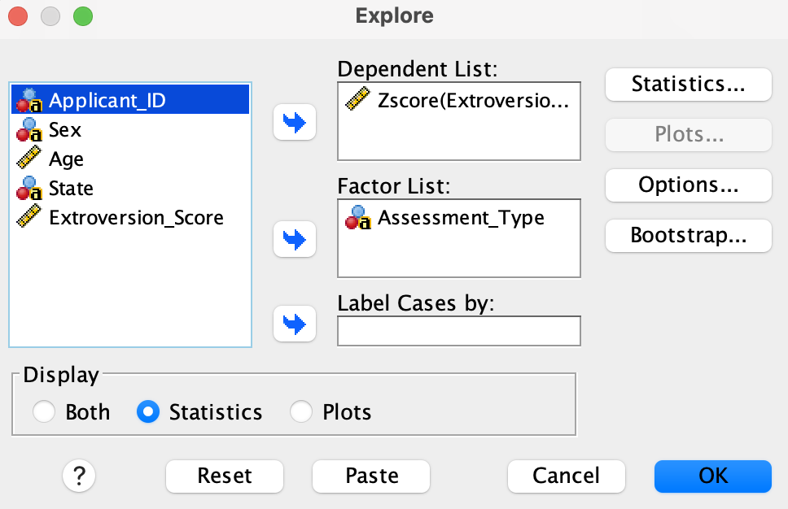
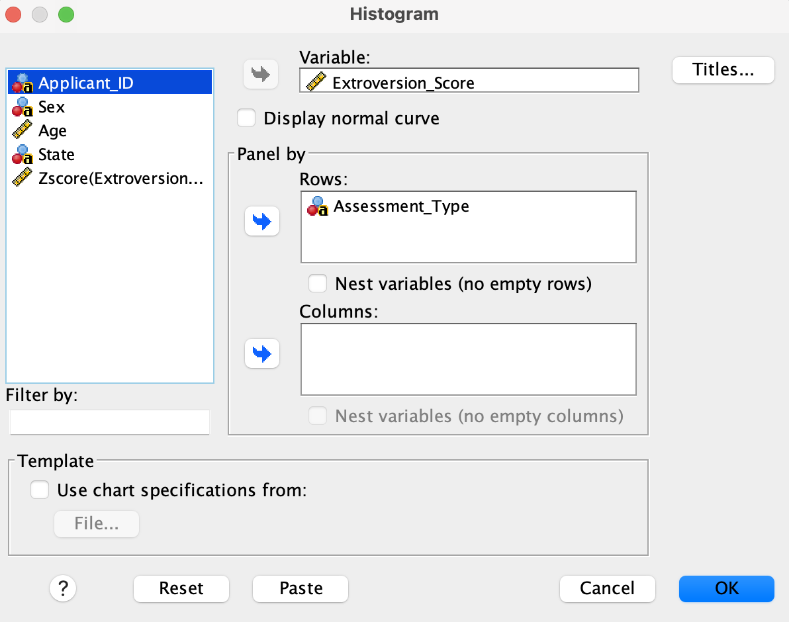
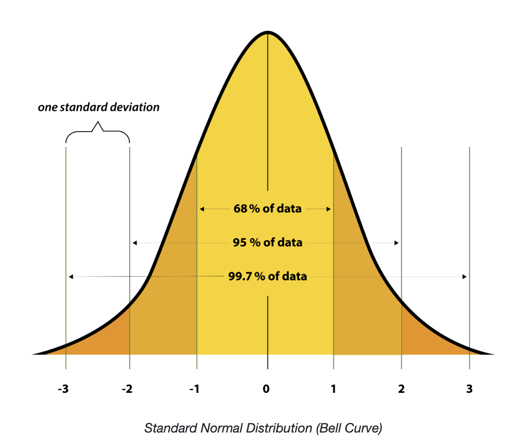

## Overview

An employer is interested in identifying the ten most extroverted individuals from a pool of applicants. To do this, 500 applicants from New York and New Jersey completed two different personality assessments, as described below.

- **The Big Five Inventory (BFI)** — an 8-item questionnaire with a maximum score of 40.
- **The Eysenck Personality Inventory (EPI)** — a 12-item questionnaire with a maximum score of 24.

The full versions of these questionnaires are much longer and measure a wide range of personality traits. However, for the purposes of this lab, we will focus only on the extroversion scores from each assessment.

Note that the employer can't select applicants based on raw scores alone, as the two assessments have different scoring scales. To overcome this, we will need to use SPSS to convert the scores to $z-scores$ to allow direct comparison.

::: {.callout-note title="Learning Objectives"}
By the end of this lab, you should be able to:

- Use SPSS to generate $z-scores$.
- Use SPSS to sort data and identify the top/bottom scores.
- Examine the characteristics of $z-scores$ and their distributions.
- Describe the characteristics of the standard normal distribution and compare it to Z-scores.
:::

## Part 1 — The Data

The data set for today's lab are available on the following link:

[Lab 4 Data](datasets/personality.csv)

Download the data and use SPSS to open them. Then import it to SPSS by following these steps:

**File \> Import Data \> CSV Data...**, browse to the file location, and click **OK** on the import wizard (accept the default settings).

Make sure the measurement scales are set as follows:

- `Applicant_ID` = Nominal
- `Sex` = Nominal
- `Age` = Scale
- `State` = Nominal
- `Assessment_Type` = Nominal
- `Extroversion_Score` = Scale

::: {.callout-tip title="Checkpoint"}
Click on the **Variable View** and the **Data View** tabs at the bottom of the SPSS window. Ensure that the variables and the data display correctly. They should appear as shown in the screenshots below.
:::

## Part 2 — The z-score Conversion

Although we have one data set, we will first need to program SPSS to treat the two assessments as separate data sets since the assessments are different. To do this, we will use the `Split File` function in SPSS. Follow the steps below:

- Click **Data** \> **Split File** \> Select **Compare groups** 
- Send `Assessment_Type` into the **Group Based on** box 
- Click **OK**.

After you split a file in that manner, any analysis you perform will be done separately for each assessment.

Now, we will use SPSS to convert the extroversion scores to $z-scores$. Follow the steps below:

- Click **Analyze** \> **Descriptive Statistics** \> **Descriptives**.
3.  Highlight the column label **Extroversion_Score** and click the arrow to move it to the **Variable(s)** box.
4.  Click the **Save standardized values as variables** check box.
5.  Click **OK**.

A new column (variable) in the main data set called `ZExtroversion_Score` should appear. This new variable contains the $z-scores$ for each applicant's extroversion score. Importantly, the $Z-scores$ are calculated separately for each assessment, so they are now comparable across the two assessments.

You can now order the scores to identify the top 10 most extroverted individuals. To do this, follow the steps below:

- Go to **Data** \> **Sort Cases**.
- Move `ZExtroversion_Score` into the **Sort by** box.
- Select **Descending** (high to low) and
- Click **OK**.

Alternatively, you can highlight the `ZExtroversion_Score` column in the data view, right click then choose **Sort Descending**. See below:

{fig-align="center" width="552"}

::: {.callout-tip title="Checkpoint 2"}
Who are the top ten most extroverted individuals? Record their `Applicant_ID`'s, the assessment they took (BFI or EPI) and `ZExtroversion_Scores`.
:::

## Part 3 — Characteristics of Z-scores

### Mean and Standard Deviation

We want to explore the **mean** and **standard deviation** of the $z-scores$ for each assessment. To do this, follow the steps below:

- Go to **Analyze** \> **Descriptive Statistics**\>**Explore**
- Move `Assessment_Type` into the **Factor List** and `ZExtroversion_Score` into the **Dependent List**.
- Select **Statistics**

Your set up should look as shown below:

{fig-align="center" width="552"}

- Click **OK**.

::: {.callout-tip title="Checkpoint "}
What do you notice about the mean and standard deviation of the $z-scores$? Would you expect this to be the case every time we convert any set of scores to Z-scores? Explain.
:::

### Examining the Distributions (Shape) of Z-scores

There is a common misconception that z-scores (standardized scores) are always normally distributed. We will show that this claim is not true by creating histograms for the original assessments and compare them to the histograms of the corresponding $z-scores$.

- Go to **Graphs** \> **Chart Builder** \> **Histogram**.

- Move `Extroversion_Score` into the **Variable** box and `Assessment_Type` into the **Panel** box under `Rows`. Your set up should look as shown below:

  {fig-align="center" width="539"}

- Click **OK**.

Now repeat the above process but this time use `ZExtroversion_Score` instead of `Extroversion_Score`. Your set up should look as shown below:

::: {.callout-tip title="\"Checkpoint"}
How would you describe the distribution of the original extroversion scores for each assessment? How do these compare to the distribution of the $z-scores$?
:::

## Part 4 — The Standard Normal Distribution

The standard normal distribution is a special case of the **normal distribution** with a mean of 0 and a standard deviation of 1. It is a theoretical distribution that researchers commonly use to examine how well a set of data fits the normal distribution. Below is a screenshot of the standard normal distribution.

[{fig-align="center" width="519"}](https://www.nlm.nih.gov/oet/ed/stats/02-800.html)

::: {.callout-note title="Important Notes about the Standard Normal Distribution"}
- The mean, median, and mode are all equal to 0 (center of the distribution).
- The distribution is bell-shaped and symmetric about the mean.
- The standard deviation is equal to 1.
- 95% of the data falls within 2 standard deviations; while 99.7% (nearly all data) falls within 3 standard deviations of the mean.
- The further you go from the mean in either direction, the less likely you are to find data points in that region. Data that that are more than 2 sd's from the mean are very unlikely while those beyond 3 standard deviations can be considered outliers.
:::

## Take-Home Lab Exercises

Before beginning the lab, you will need to undo the **split file** option that was enabled earlier by going to **Data** \> **Split File** \> **Analyze all cases, do not create groups** \> **OK**. Some exercises here may require use of **split file**, so you will need to repeat the steps above to split the file again when necessary.

1.  Make a box plot to visualize the `Age` variable. Based on this box plot, a student claims that the ages of the applicants are "normally distributed". Would you agree with this claim? Why or why not?
2.  Use SPSS to find the top 10 most extroverted females in the data. Record their `Applicant_ID'`s and describe the steps you took in SPSS to find them.
3.  Using SPSS, find the 10 most extroverted individuals from New Jersey. Record their `Applicant_ID` and describe the steps you took in SPSS to solve this problem.
4.  Suppose we want to find the 10 most extroverted individuals aged between 20 and 30 years old (inclusive). Use SPSS to solve this problem and briefly describe your steps.

## Submission Checklist

- [ ] A saved SPSS data (.sav) file showing the variables and data (includes $z-scores$).
- [ ] SPSS output file (.spv) showing the analyses performed.
- [ ] Completed responses for the Questions above. This document should be typed (Times New Roman, Font size 12, double spaced). The document should include necessary SPSS output tables and graphs. Remember that SPSS output tables and graphs can be copied and pasted into a word document.
