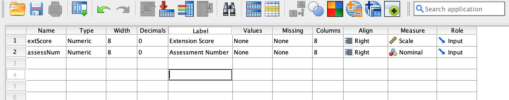
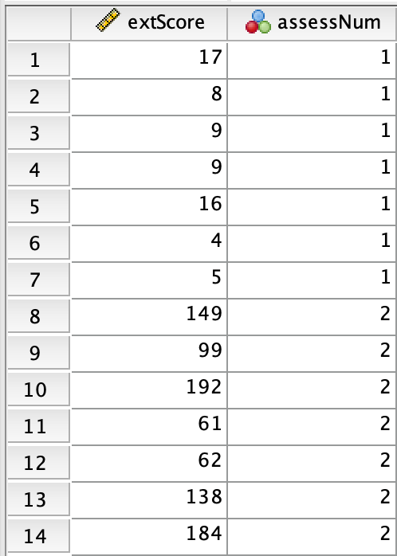

::: callout-note
## Student Information

**Name:** \_\_\_\_\_\_\_\_\_\_\_\_\_\_\_\_\_\_\_\_\_\_\_\_\_\_\_\_\_\_\_\_\
**Date:** \_\_\_\_\_\_\_\_\_\_\_\_\_\_\_\_\_\_\_\_\_\_\_\_\_\_\_\_\_\_\_\_
:::

**Estimated time:** 45–60 minutes\
**Deliverables:** completed responses (checkpoints), SPSS output showing analyses, a saved `.sav` file.

## Overview

An employer is interested in identifying the top five most extroverted individuals from either assessment in the pool of applicants. Importantly the employer cant select applicants based on raw scores alone, as the two assessments have different scoring scales. To overcome this, we will need to use SPSS to convert the scores to $z-scores$ to allow direct comparison.

::: {.callout-note title="Learning Objectives"}
By the end of this lab, you will be able to: 

- Use SPSS to compute $z-scores$ for two different assessments. 
- Use SPSS to identify the top five most extroverted individuals based on $z-scores$.
:::

## Part 1 — The Data

::: {.callout-important title="Before You Begin"}
The tables below show the raw scores for the two extroversion assessments. The first assessment is a 10-item questionnaire with a maximum score of 20, while the second assessment is a 20-item questionnaire with a maximum score of 200.

| Applicant | Score |
|-----------|-------|
| 1         | 17    |
| 2         | 8     |
| 3         | 9     |
| 4         | 9     |
| 5         | 16    |
| 6         | 4     |
| 7         | 5     |

: Extroversion Assessment 1

| Applicant | Score |
|-----------|-------|
| 8         | 149   |
| 9         | 99    |
| 10        | 192   |
| 11        | 61    |
| 12        | 62    |
| 13        | 138   |
| 14        | 184   |

: Extroversion Assessment 2
:::

------------------------------------------------------------------------

**Entering the Variables:** Open SPSS Statistics on your lab computer. When it opens, you may see a "What's New" or "Welcome" dialog box — close it. You should be looking at a blank **Data Editor** window with a grid of empty cells. Make sure you are under **variable view**

### Row 1: extScore

1.  Click the first cell in **row 1, "Name" column**. Type: `extScore`
2.  Leave **Type** as the default (Numeric).
3.  Click the **Decimals** cell for this row. Change it to `0` (the scores are whole numbers).
4.  Click the **Label** cell. Type: `Extroversion Score`
5.  Click the **Measure** cell. Click the dropdown arrow and select `Scale`.

### Row 2: assessNum

1.  Click the empty cell in **row 2, "Name" column**. Type: `extScore`
2.  Leave **Type** as the default (Numeric).
3.  Set the **Decimals** to `0`.
4.  Set the **Label** to `Assessment Number`
5.  Set the **Measure** to `nominal`.

If you entered everything as per the instructions up to this point, the variable view will appear as follows:

{fig-align="center"}

**Entering the Data:** After creating the variables, switch to **Data View** by clicking the tab at the bottom of the SPSS window. You will see a grid with two columns: `extScore` and `assessNum`. Enter the data from the tables above into the appropriate columns. For example, for Applicant 1, enter `17` in the `extScore` column and `1` in the `assessNum` column. Continue entering all the data for both assessments. Your completed data view should look like this:

{fig-align="center" width="360"}

------------------------------------------------------------------------

::: {.callout-tip title="Checkpoint 1"}
1. Why did we record the variable `assessNum` as a nominal variable in the data set even though its entries are numbers? \vspace{2in}
2. A student suggested that converting the scores to percentages without finding $z-scores$ would be sufficient to allow for a direct comparison between the two assessments. Do you agree or disagree with this suggestion? Why or why not? \vspace{2in}
:::

## Part 2 — The z-score Conversion

Although we have one dataset, we will first need to program SPSS to treat the two assessments as separate datasets since the assessments are different. To do this, we will use the `Split File` function in SPSS. Follow the steps below:

1. Click `Data` > `Split File` > `Organize output by groups` > `Select` `assessNum` > Click `OK`. 
2. Click `Analyze` > `Descriptive Statistics` > `Descriptives`. 
3. Highlight the column label `extScore` and click the arrow to move it to the **Variable(s)** box.
4. Click the `Save standardized values as variables` checkbox.
5. Click `OK`.

The output will produce the usual SPSS output window with the descriptive statistics for each assessment, as well as a new column (variable) in the main dataset called `ZextScore`. This new variable contains the $z-scores$ for each applicant's extroversion score. The data view will now look like this:

::: {.callout-tip title="Checkpoint 2"} 
3. Based on the computed $z-scores$, which applicants are the top five most extroverted individuals? List their applicant numbers and $z-scores$. \vspace{2in} 
:::

## Submission Checklist

- [ ] A saved SPSS data (.sav) file showing the variables and data (includes $z-scores$).
- [ ] SPSS output file (.spv) showing the analyses performed. 
- [ ] Completed responses for all checkpoints in the lab. You may print a PDF from the website and hand-write your responses or use a digital annotator tool.

